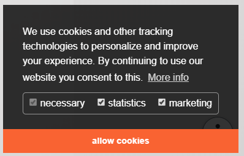
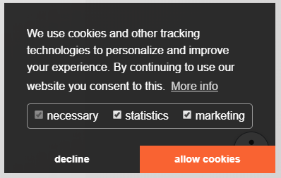
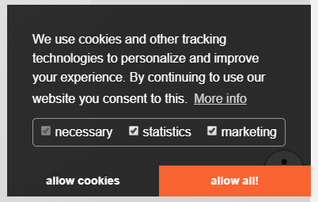
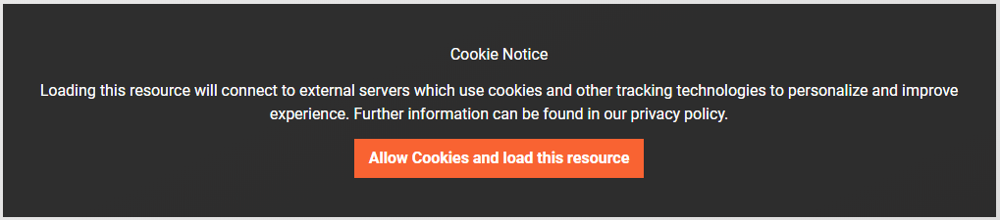

# DP Cookie Consent
[](https://www.paypal.me/dirkpersky)
[](https://www.npmjs.com/package/@dirkpersky/dp_cookieconsent)
[](https://www.npmjs.com/package/@dirkpersky/dp_cookieconsent)

This Plugin includes the most popular solution to the EU Cookie law JavaScript Plugin [Cookie Consent](https://cookieconsent.insites.com/).
I extended it with Script and iFrame helper, so it works with the ePrivacy law.

Though don't care about the latest EU laws and handle you Cookies with this Plugins.

```npm
npm i @dirkpersky/dp_cookieconsent
```

## Config
**window.cookieconsent_options.**

| Property                  | Description                                   | Options                                   | Default |
| ------------------------- | --------------------------------------------- | ----------------------------------------- | -------:|
| content.href              | URL to Data Protection                        |                                           | |
| content.target            | Link target of read more link                 |                                           | _blank |
| theme                     | Layout of the consent                         | edgeless, block, wire, classic            | edgeless |
| position                  | position of the consent                       | bottom, top, bottom-left, bottom-right    | bottom-right |
| dismissOnScroll           | auto accecpt consent on scroll after XX px    |                                           | | 
| autoOpen                  | The application automatically decide whether the popup should open | true, false          | true | 
| revokable                 | Some countries REQUIRE that a user can change their mind | true, false                    | true | 
| type                      | consent types *([screenshot](#types))*        | info, opt-out, opt-in                     | info |
| layout                    | consent layout                                | basic, dpextend                           | dpextend |
| reloadOnRevoke            | reload page after consent revoke (stop tracking) | true, false                               | false |
| checkboxes.statistics     | pre check statistics in checkboxes layout     | true, false                               | false |
| checkboxes.marketing      | pre check marketing in checkboxes layout      | true, false                               | false |
| overlay.notice            | enable or disable overlay                     | true, false                               | false |
| overlay.box.background    | Overlay: Background color                     | rgba(), #hexa                             | rgba(0,0,0,.8) |
| overlay.box.text          | Overlay: text color                           | rgb(), #hexa                              | #fff |
| overlay.button.background | Overlay: Button Background color              | rgba(), #hexa                             | #b81839 |
| overlay.button.text       | Overlay: Button text color                    | rgb(), #hexa                              | #fff |
| palette.popup.background  | Consent Background color                      | rgba(), #hexa                             | rgba(0,0,0,.8) |
| palette.popup.text        | Consent Text color                            | rgb(), #hexa                              | #fff |
| palette.button.background | Consent Button Background color               | rgba(), #hexa                             | #f96332 |
| palette.button.text       | Consent Button Text color                     | rgb(), #hexa                              | #fff |


### types
the screenshots are basesd one the `window.cookieconsent_options.layout = dpextend`

| info                                 | opt-out                                 | opt-in                                 |
| ------------------------------------ | --------------------------------------- | -------------------------------------- |
|  |  |  |

## Features

### load scripts after accepting
**load script sources**
If you want to load JavaScript resources after the Cookie is accepted you can use this snipped
```html
<script data-cookieconsent="statistics" type="text/plain" data-src="{YOUR_LINK_TO_JS}"></script>
```

**load inline script**
If you want to load Inline JavaScript after the Cookie is accepted use this snipped.
```html
<script data-cookieconsent="statistics" type="text/plain">
{YOUT_DYN_JS_CODE}
</script>
```


### Checkboxe mode
You can extend the default cookie message with checkboxes, by activiating the layout in the TYPO3 constants  `window.cookieconsent_options.layout = dpextend`.
Now your customer can choose what types of scripts/cookies he want to allow.

This 3 types are possible and handled by the consent:

| Type       | Description                                          | example | 
| ---------- | ---------------------------------------------------- | --------- |
| required   | all normal script, will always called                | `<script type="text/javascript" ...`
| statistics | scripts that will only run after consent handling    | `<script data-cookieconsent="statistics" type="text/plain"...`
| marketing  | scripts that will only run after consent handling    | `<script data-cookieconsent="marketing" type="text/plain"...`

### load iframe after accepting
If you want to load iFrame's (YouTube, GMap, ..) after the Cookie is accepted you can use this snipped
```html
<iframe width="560" height="315" 
    data-cookieconsent="statistics" 
    data-src="https://www.youtube-nocookie.com/embed/XXXXXX?autoplay=1" 
    class="dp--iframe"
    frameborder="0" allow="accelerometer; autoplay; encrypted-media; gyroscope; picture-in-picture" allowfullscreenn >
</iframe>
```
With the `class="dp--iframe"` the iFrame is hidden in default and would be shown after the cookie acceptioning.

#### iframe overlay
**if you want to add an overlay to accept Cookies outside from the cookie hint**

you can enable this feature in the TYPO3-constants<br/>
`window.cookieconsent_options.overlay.notice = true`

you also can modify the text in this hint individuel per iframe
```html
<iframe
    data-cookieconsent="statistics" 
    data-src="https://www.youtube-nocookie.com/embed/XXXXXX?autoplay=1" 
    class="dp--iframe"

    data-cookieconsent-notice="Cookie Notice"
    data-cookieconsent-description="Loading this...."
    data-cookieconsent-btn="allow cookies and load this ...."
>
</iframe>
```

#### build your own overlay
or accept/deny cookies outside of the cookie hin, you can use the followed example
```html
<button 
    onclick="window.DPCookieConsent.forceAccept(this)" 
    data-cookieconsent="statistics" 
>allow cookies and play video</button>

```
**allow cookies**<br/>
`window.DPCookieConsent.forceAccept(this)`

**deny cookies**<br/>
`window.DPCookieConsent.forceDeny(this)`

### Events
| Event                     | Description                                   | Options                                   |
| ------------------------- | --------------------------------------------- | ----------------------------------------- |
| dp--cookie-init           | fire event when initialize process is done    |                                           |
| dp--cookie-fire           | fire after a consent script/iframe is loaded  | event.detail.$el                          |
| dp--cookie-accept         | fire when the consent is accepted             |                                           |
| dp--cookie-accept-init    | fire accepted event on revisited              |                                           |
| dp--cookie-deny           | fire when the consend is denied               |                                           |
| dp--cookie-revoke         | fire when the consent is revoked              |                                           |

```javascript
document.addEventListener('dp--cookie-fire', function (e) {
    console.log('dp--cookie-fire', e.detail.$el);
});
document.addEventListener('dp--cookie-accept', function (e) {
    console.log('dp--cookie-accept', e);
});
document.addEventListener('dp--cookie-deny', function (e) {
    console.log('dp--cookie-deny', e);
});
document.addEventListener('dp--cookie-revoke', function (e) {
    console.log('dp--cookie-deny', e);
});
```

### Custom Design
```html
<script type="text/plain" data-dp-cookiedesc="layout">
    {{message}}
    <a aria-label="learn more about cookies"
       role=button tabindex="0"
       class="cc-link"
       href="{{href}}"
       rel="noopener noreferrer nofollow"
       target="{{target}}"
    >
        {{link}}
    </a>
</script>
```
```html
<script type="text/plain" data-dp-cookieselect="layout">
    <div class="dp--cookie-check" xmlns:f="http://www.w3.org/1999/html">
        <label for="dp--cookie-require">
            <input type="checkbox" id="dp--cookie-require" class="dp--check-box" checked="checked" disabled="disabled" />
            {{dpRequire}}
        </label>
        <label for="dp--cookie-statistics">
            <input type="checkbox" id="dp--cookie-statistics" class="dp--check-box" {{checked.statistics}} value="" />
            {{dpStatistik}}
        </label>
        <label for="dp--cookie-marketing">
            <input type="checkbox" id="dp--cookie-marketing" class="dp--check-box" {{checked.marketing}} value="" />
            {{dpMarketing}}
        </label>
    </div>
</script>
```
```html
<script type="text/plain" data-dp-cookierevoke="layout">
    <div class="cc-revoke dp--revoke {{classes}}">
        <i class="dp--icon-fingerprint"></i>
        <span class="dp--sr-only">{{policy}}</span>
    </div>
</script>
```


#### Dynamic Checkboxes
With this feature you can add or modify the checkbox types by configuration.
All you have to do is setting your new checkbox in TS and add it to the partial template:

```html
<script type="text/plain" data-dp-cookieselect="layout">
    ...
        <label for="dp--cookie-statistics">
            <input type="checkbox" id="dp--cookie-thirdparty" class="dp--check-box" {{checked.thirdparty}} value="" />
            TEXT
        </label>
     ...
</script>
```

```javascript
window.cookieconsent_options.checkboxes = {
    statistics = true
    marketing = false
    thirdparty = false
}
```

## change Cookie Settings
you can overwrite the cookie settings with a global definition  
```javascript
window.cookieconsent_options_cookie = {
    // This is the url path that the cookie 'name' belongs to. The cookie can only be read at this location
    path: '/',
    // This is the domain that the cookie 'name' belongs to. The cookie can only be read on this domain.
    //  - Guide to cookie domains - https://www.mxsasha.eu/blog/2014/03/04/definitive-guide-to-cookie-domains/
    domain: '',
    // The cookies expire date, specified in days (specify -1 for no expiry)
    expiryDays: 30,
    // If true the cookie will be created with the secure flag. Secure cookies will only be transmitted via HTTPS.
    secure: false
}
```

## Please give me feedback
I would appreciate any kind of feedback or ideas for further developments to keep improving the extension for your needs.

## Say thanks! and support me
You like this extension? Get something for me (surprise!) from my wishlist on [Amazon](https://www.amazon.de/hz/wishlist/ls/15L17XDFBEYFL/r) or [](https://www.paypal.me/dirkpersky) the next pizza. Thanks a lot!

### Contact us
- [E-Mail](mailto:info@dp-dvelop.de)
- [GitHub](https://github.com/DirkPersky/npm-dp_cookieconsent)
- [NPM](https://www.npmjs.com/package/@dirkpersky/dp_cookieconsent)
- [Homepage](http:/dp-dvelop.de)
- [TYPO3 PlugIn](https://github.com/DirkPersky/typo3-dp_cookieconsent)
